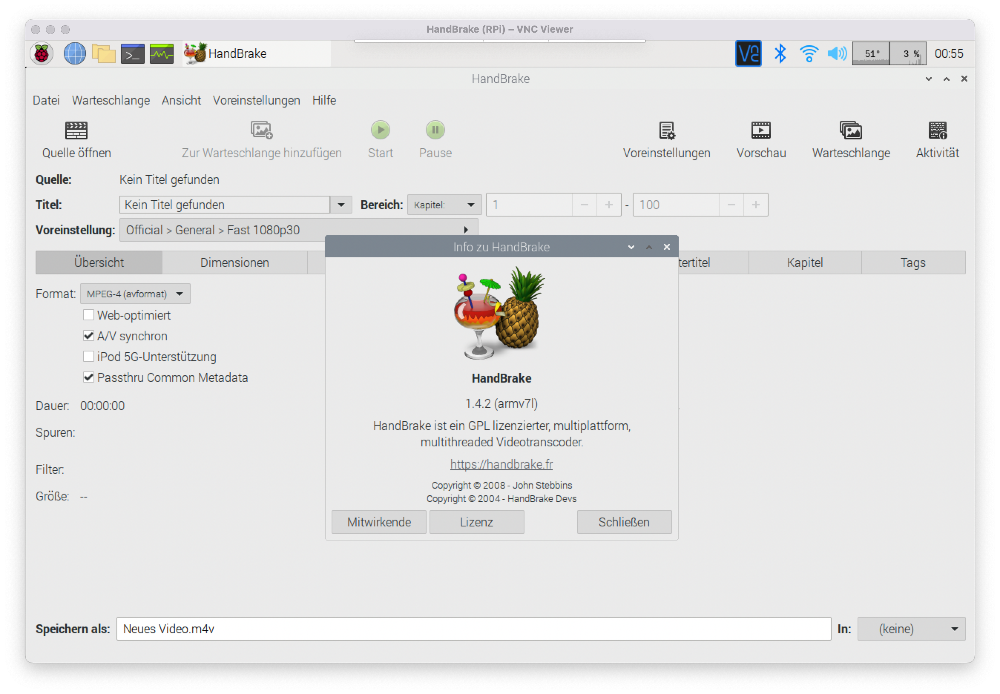

# Handbrake on Raspberry Pi

Building Handbrake CLI and GUI on Raspberry Pi 4 including x265 codec



Does it make sense to build Handbrake on Raspberry Pi? Be warned it wont be fast. 10-20 times slower that i5 Intel CPU laptop. But it works so why not.

I have managed successfully compile it on RPi 2B+, 3 and 3B+ running raspbian 4.14.98 (`kapitainsky`) and on RPi 4 running raspbian 5.4.51 (`rafaelmaeuer`).

**This repository includes [scripts](./scripts) and [desktop-shortcuts](./desktop) to:**

- monitor temperature while encoding
- limit CPU usage for encoding
- automatic shutdown after encoding
- send notification (ifttt) before shutdown
- delay countdown for user interruption
- eject/spindown of HDD when shutdown
- scan h264 level of MKV (recursively)

### 1. Install all dependencies

For CLI:

```sh
sudo apt-get install git autoconf automake build-essential cmake libass-dev libbz2-dev libfontconfig1-dev libfreetype6-dev libfribidi-dev libharfbuzz-dev libjansson-dev liblzma-dev libmp3lame-dev libogg-dev libopus-dev libsamplerate-dev libspeex-dev libtheora-dev libtool libtool-bin libvorbis-dev libx264-dev libxml2-dev m4 make patch pkg-config python tar yasm zlib1g-dev libvpx-dev xz-utils bzip2 zlib1g meson libnuma-dev
```

For GUI:

```sh
sudo apt-get install intltool libappindicator-dev libdbus-glib-1-dev libglib2.0-dev libgstreamer1.0-dev libgstreamer-plugins-base1.0-dev libgtk-3-dev libgudev-1.0-dev libnotify-dev libwebkitgtk-3.0-dev
```

### 2. Debian nasm is too old, so get a newer one

```sh
sudo curl -L 'http://ftp.debian.org/debian/pool/main/n/nasm/nasm_2.14-1_armhf.deb' -o /var/cache/apt/archives/nasm_2.14-1_armhf.deb && sudo dpkg -i /var/cache/apt/archives/nasm_2.14-1_armhf.deb
```

### 3. Get the HandBrake source code

```sh
# Download
wget https://github.com/HandBrake/HandBrake/releases/download/1.3.3/HandBrake-1.3.3-source.tar.bz2

# Unpack
tar -xf HandBrake-1.3.3-source.tar.bz2
```

### 4. Add extra configure parameters to X265 module

Without it won't compile on RPi

```sh
echo "X265_8.CONFIGURE.extra +=  -DENABLE_ASSEMBLY=OFF -DENABLE_PIC=ON -DENABLE_AGGRESSIVE_CHECKS=ON -DENABLE_TESTS=ON -DCMAKE_SKIP_RPATH=ON" >> ./contrib/x265_8bit/module.defs \
&& \
echo "X265_10.CONFIGURE.extra +=  -DENABLE_ASSEMBLY=OFF -DENABLE_PIC=ON -DENABLE_AGGRESSIVE_CHECKS=ON -DENABLE_TESTS=ON -DCMAKE_SKIP_RPATH=ON" >>  ./contrib/x265_10bit/module.defs \
&& \
echo "X265_12.CONFIGURE.extra +=  -DENABLE_ASSEMBLY=OFF -DENABLE_PIC=ON -DENABLE_AGGRESSIVE_CHECKS=ON -DENABLE_TESTS=ON -DCMAKE_SKIP_RPATH=ON" >>  ./contrib/x265_12bit/module.defs \
&& \
echo "X265.CONFIGURE.extra  +=  -DENABLE_ASSEMBLY=OFF -DENABLE_PIC=ON -DENABLE_AGGRESSIVE_CHECKS=ON -DENABLE_TESTS=ON -DCMAKE_SKIP_RPATH=ON" >>  ./contrib/x265/module.defs
```

### 5. Configure the project

For CLI only:

```sh
./configure --launch-jobs=$(nproc) --disable-gtk --disable-nvenc --disable-qsv --enable-fdk-aac
```

For CLI and GUI:

```sh
./configure --launch-jobs=$(nproc) --disable-nvenc --disable-qsv --enable-fdk-aac
```

### 6. Make quick-and-dirty hack to x265 source code

Code compiles with `DENABLE_ASSEMBLY=OFF` but x265 code does not take it into account that they don't handle it right for ARMv7 (I have reported it to X265 guys so maybe in the future it wont be required if they modify their code)

But first start building so things get downloaded

```sh
cd build
```

```sh
make -j 4 x265
```

Wait until you see that files have been downloaded then CTRL-C

```sh
nano ./contrib/x265/x265_3.2.1/source/common/primitives.cpp
```

and change following section - at the end of the file:

```cpp
#if X265_ARCH_ARM == 0
void PFX(cpu_neon_test)(void) {}
int PFX(cpu_fast_neon_mrc_test)(void) { return 0; }
#endif // X265_ARCH_ARM
```

to

```cpp
#if X265_ARCH_ARM != 0
void PFX(cpu_neon_test)(void) {}
int PFX(cpu_fast_neon_mrc_test)(void) { return 0; }
#endif // X265_ARCH_ARM
```

just change `==` condition to `!=`

### 7. Build all now

```sh
make clean
```

```sh
make -j $(nproc)
```

Take a break - it finishes in about 30 min on RPi 3B+, twice as long on RPi 2B+

### 8. Check for binaries

When finished following executable binaries should exist

- CLI: `build/HandBrakeCLI`
- GUI: `build/gtk/src/ghb`

### 9. Use it straight away or install properly

```sh
sudo make --directory=. install
```

### 10. Basic usage

```sh
HandBrakeCLI -i PATH-OF-SOURCE-FILE -o NAME-OF-OUTPUT-FILE --"preset-name"
```

To see available profiles:

```sh
HandBrakeCLI --preset-list
```

Example:

```sh
./HandBrakeCLI -i /media/Films/test.avi -o /media/Films/test.mkv --preset="H.264 MKV 720p30"
```

### Sources

[https://github.com/kapitainsky/handbreak-RaspberryPi/issues/2](https://github.com/kapitainsky/handbreak-RaspberryPi/issues/2)

[https://handbrake.fr/docs/en/1.2.0/developer/install-dependencies-debian.html](https://handbrake.fr/docs/en/1.2.0/developer/install-dependencies-debian.html)

[https://handbrake.fr/docs/en/1.2.0/developer/build-linux.html](https://handbrake.fr/docs/en/1.2.0/developer/build-linux.html)

[https://mattgadient.com/2016/06/20/handbrake-0-10-5-nightly-and-arm-armv7-short-benchmark-and-how-to/](https://mattgadient.com/2016/06/20/handbrake-0-10-5-nightly-and-arm-armv7-short-benchmark-and-how-to/)

[https://retropie.org.uk/forum/topic/13092/scrape-videos-and-reencode-them-directly-on-the-raspberry-pi-with-sselph-s-scraper](https://retropie.org.uk/forum/topic/13092/scrape-videos-and-reencode-them-directly-on-the-raspberry-pi-with-sselph-s-scraper)

[https://www.linux.com/learn/how-convert-videos-linux-using-command-line](https://www.linux.com/learn/how-convert-videos-linux-using-command-line)

[https://handbrake.fr/docs/en/1.2.0/cli/cli-options.html](https://handbrake.fr/docs/en/1.2.0/cli/cli-options.html)
